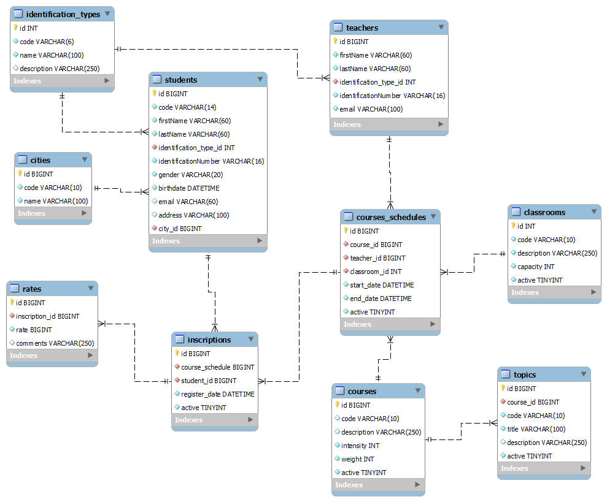

# ACME School

ACME School es una aplicación de consola para gestionar información académica:
ciudades, aulas, cursos, horarios, tipos de identificación, inscripciones,
calificaciones, estudiantes, docentes y temas. Usa Node.js y MySQL, y separa
la interfaz de consola, las reglas de negocio y el acceso a datos.

## Requisitos

- Node.js 18 o posterior
- MySQL con el esquema de `src/database/acme-school.sql`

## Instalación y uso

1. Instala las dependencias:

	 ```sh
	 npm install
	 ```

2. Crea la base de datos ejecutando `src/database/acme-school.sql` en MySQL.

3. Opcionalmente, copia `.env.example` a `.env` y configura la conexión:

```sh
cp .env.example .env
```

En PowerShell puedes usar `Copy-Item .env.example .env`. La aplicación carga
`.env` automáticamente. Las variables admitidas son:

- `DB_HOST` (predeterminado: `localhost`)
- `DB_USER`
- `DB_PASSWORD`
- `DB_NAME` (predeterminado: `acme_school`)
- También se aceptan `MYSQL_HOST`, `MYSQL_USER`, `MYSQL_PASSWORD` y `MYSQL_DATABASE`.

4. Inicia la aplicación:

```sh
npm start
```

El menú principal abre el submenú CRUD de cada entidad. Las operaciones
requieren que existan previamente los registros referenciados por claves
foráneas. Para ejecutar las pruebas automatizadas:

```sh
npm test
```

## Estructura del proyecto

```text
index.js                         Menú principal y composición de la CLI
src/
	cli/                            Menús y operaciones CRUD de consola
	config/                         Conexión a MySQL y entrada compatible
	database/acme-school.sql        Esquema de la base de datos
	models/                         Modelos de las entidades
	patterns/factory/               Factoría de servicios
	repository/                     Consultas SQL por entidad
	services/                       Validaciones y lógica de negocio
test/                             Pruebas automatizadas con node:test
```


## Diagrama


## Principios SOLID

- **Responsabilidad única (SRP):** los menús atienden la interacción; los
	servicios validan y coordinan operaciones; los repositorios encapsulan SQL.
- **Abierto/cerrado (OCP):** `BaseCrudService` permite reutilizar el CRUD
	mediante servicios concretos. La factoría aún debe actualizarse al registrar
	una nueva entidad, por lo que la aplicación de este principio es parcial.
- **Sustitución de Liskov (LSP):** los servicios específicos conservan las
	operaciones CRUD públicas definidas por `BaseCrudService`.
- **Segregación de interfaces (ISP):** JavaScript no declara interfaces
	formales en este proyecto; los servicios usan repositorios con operaciones
	concretas en lugar de un objeto de acceso genérico.
- **Inversión de dependencias (DIP):** los servicios reciben repositorios por
	constructor, lo que permite inyectar dobles de prueba. La factoría conecta las
	implementaciones concretas para la aplicación.

## Patrones de diseño

- **Repository:** los módulos de `src/repository/` aíslan las consultas MySQL
	del resto de la aplicación.
- **Factory:** `src/patterns/factory/ServiceFactory.js` construye y centraliza
	los servicios usados por el menú principal.
- **Inyección de dependencias:** los servicios aceptan sus repositorios por
	constructor; las implementaciones reales se usan como valor predeterminado y
	las pruebas pueden proporcionar repositorios simulados.

## Consideraciones técnicas

- El proyecto usa módulos ES (`"type": "module"`), `mysql2/promise` para MySQL
	y `dotenv` para cargar configuración local.
- La conexión se crea bajo demanda y se reutiliza durante la ejecución; la CLI
	la cierra al salir.
- `.env` está excluido de Git. No agregues credenciales reales al repositorio.
	Si despliegas la aplicación, configura secretos fuera del código y rota
	cualquier credencial que se haya compartido o versionado.
- El esquema aplica claves foráneas; crea primero los registros relacionados
	antes de probar inscripciones, horarios u otras entidades dependientes.

## Créditos

- Autora: Cleidy Priscila Pérez Casia.
- Tecnologías: Node.js, MySQL, `mysql2` y `dotenv`.
- Licencia: ISC.
